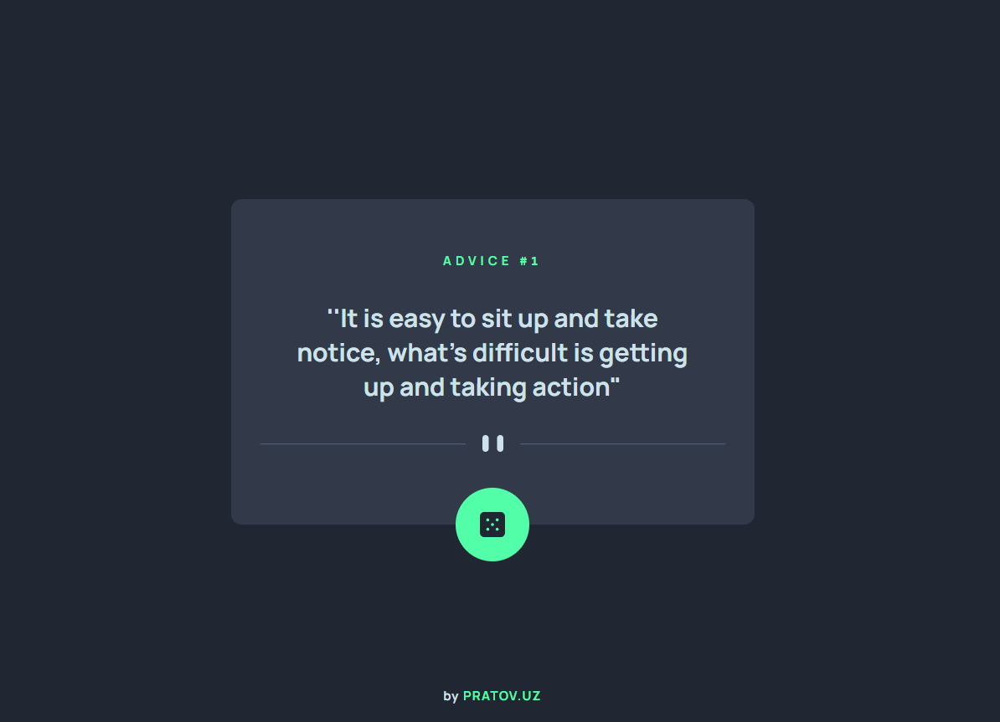

# Advice generator app - pratov.uz  

This is a solution to the [Advice generator app challenge on Frontend Mentor](https://www.frontendmentor.io/challenges/advice-generator-app-QdUG-13db).  

## Table of contents  

- [The challenge](#the-challenge)  
- [Screenshot](#screenshot)  
- [Links](#links)  
- [Built with](#built-with)  
- [Author](#author)  

---

### The challenge  

Users should be able to:  

- View the optimal layout for the app depending on their device's screen size  
- See hover states for all interactive elements on the page  
- Generate a new piece of advice by clicking the dice icon  

---

### Screenshot  

  

---

### Links  

- Solution URL: [Github](https://xpratov/advice-generator-app)  
- Live Site URL: [Vercel](https://advice-generator-app-pratov.vercel.app)  

---

### Built with  

- CSS custom properties  
- Flexbox  
- CSS Grid  
- Mobile-first workflow  
- JavaScript  
- Fetch API  

---

### Author  

- Website - [pratov.uz](https://pratov.uz)  
- X (Twitter) - [@xpratov](https://x.com/xpratov)  
- Telegram - [@xpratov](https://t.me/xpratov)  
- LinkedIn - [@pratov](https://www.linkedin.com/in/pratov)  
- Instagram - [@xpratov](https://www.instagram.com/xpratov)  
